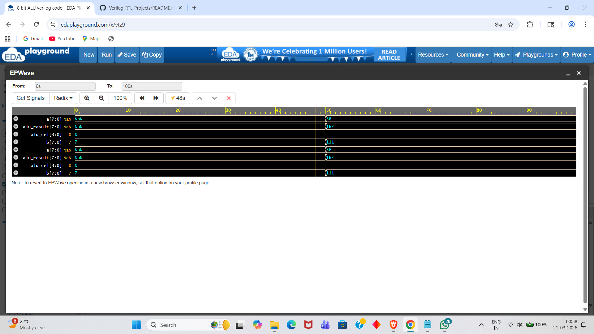
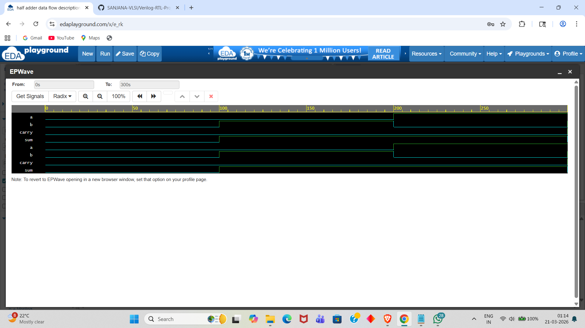
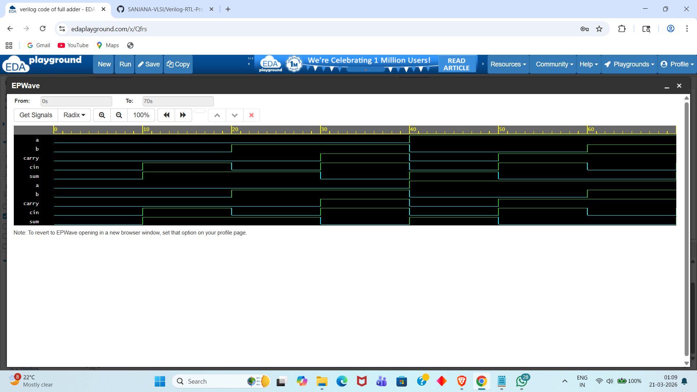
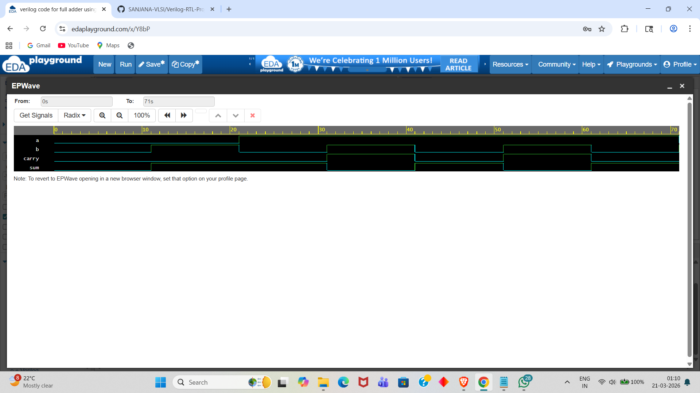
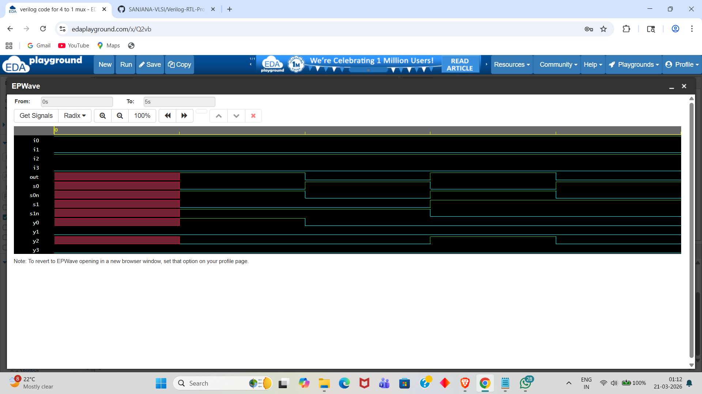
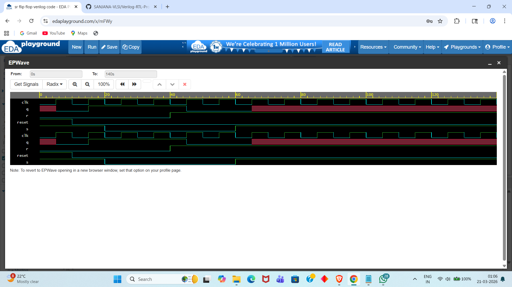

# Verilog RTL Design & Verification Portfolio

This repository contains various digital logic designs and their corresponding testbenches, developed and simulated using **Verilog HDL** on **EDA Playground**.

## 🚀 Projects Overview

### 1. 8-bit ALU (Arithmetic Logic Unit)

* **Description:** Designed an 8-bit ALU capable of performing Arithmetic (Add, Sub) and Logical (AND, OR, XOR) operations.
* **Key Learning:** Control logic and multi-bit data handling in Verilog.

### 2. Combinational Logic Designs
### 2. Combinational Logic Designs
* **Half Adder:**
    
* **Full Adder:**
    
* **Full Adder using 2 Half Adders:**
    
* **4:1 Multiplexer:**
    
* **Modules:** Half Adder, Full Adder (Hierarchical Design), and Multiplexers (4:1 Mux).
* **Focus:** Logic gate implementation and structural modeling.

### 3. Sequential Circuits
### 3. Sequential Circuits
* **SR Flip-Flop:**
    * **Description:** Designed a basic SR Flip-Flop to understand clock-triggered memory elements.
    * **Waveform Result:**
    
* **Modules:** SR Flip-Flop and Basic Counters.
* **Focus:** Clock-driven logic and state-based transitions.

## 🛠️ Tech Stack & Tools
* **Language:** Verilog HDL
* **Simulator:** Icarus Verilog 12.0 / Aldec Riviera-Pro
* **Waveform Viewer:** EPWave / GTKWave
* **Platform:** EDA Playground

---
**Developed by: Sanjana Yadav**
*VLSI & RTL Design Enthusiast*
